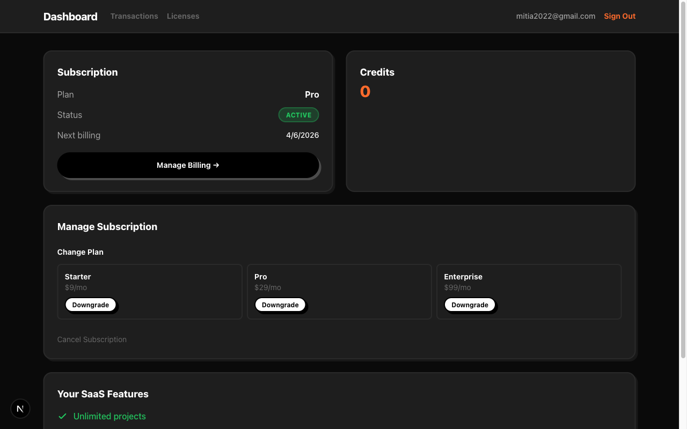
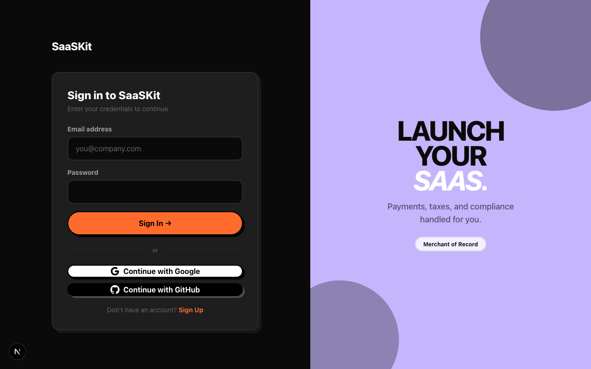
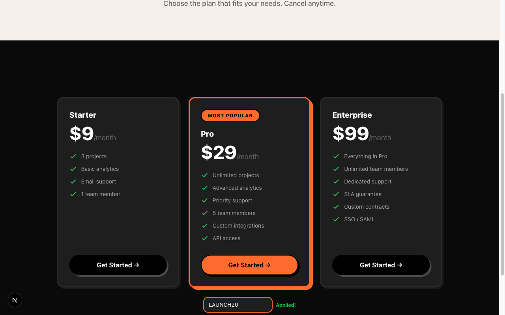
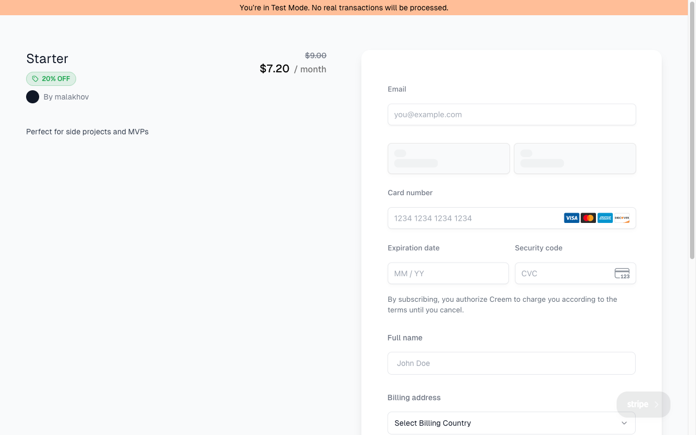
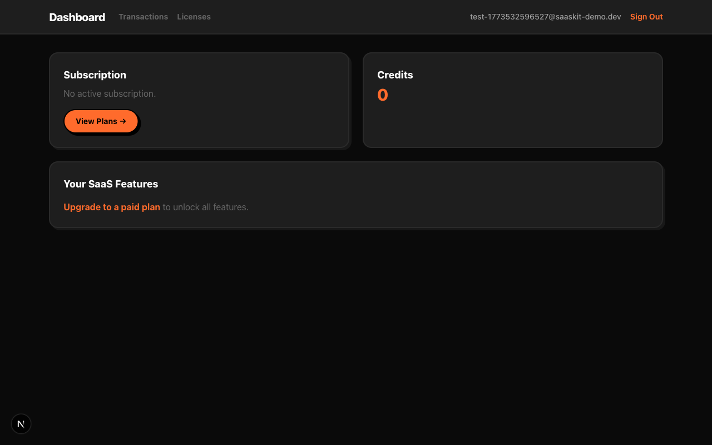
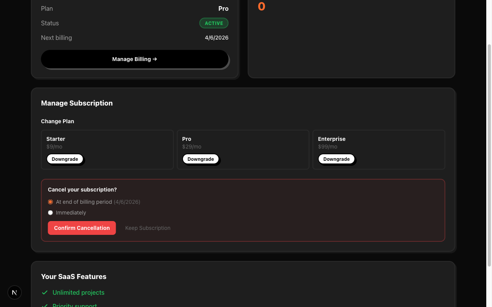
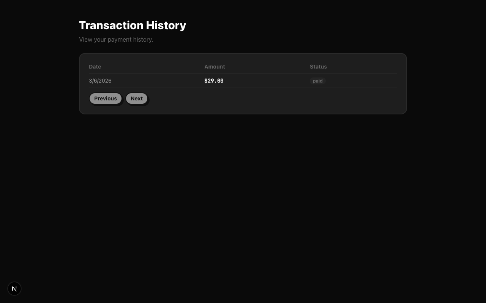

# SaaSKit — Next.js + Supabase + Creem

The most comprehensive SaaS boilerplate with Creem payments. Launch your paid SaaS in hours, not weeks.

**Auth + Database + Payments + Subscriptions + License Keys + Credits + Discount Codes** — everything you need to ship fast.

## Screenshots

| Landing Page | Dashboard (Paid) |
|:---:|:---:|
|  |  |

| Login (Email + OAuth) | Pricing + Discount Code |
|:---:|:---:|
|  |  |

| Creem Checkout (20% OFF) | Dashboard (No Subscription) |
|:---:|:---:|
|  |  |

| Cancel Subscription Dialog | Transaction History |
|:---:|:---:|
|  |  |

## Video Proofs

All flows have been recorded with Playwright and are available in the [`video-proofs/`](video-proofs/) directory:

### Full User Flows
| Video | What it shows |
|-------|---------------|
| [`COMPLETE-FLOW.webm`](video-proofs/COMPLETE-FLOW.webm) | Landing → Signup (fresh user) → Empty Dashboard → Pricing → Discount Code → Creem Checkout |
| [`PAYMENT-FLOW-v2.webm`](video-proofs/PAYMENT-FLOW-v2.webm) | Full checkout with Stripe card fill + discount LAUNCH20 (20% off) |
| [`FINAL-COMPARISON.webm`](video-proofs/FINAL-COMPARISON.webm) | Side-by-side: empty dashboard (new user) vs paid dashboard (active subscription) |

### Feature Demos
| Video | What it shows |
|-------|---------------|
| [`flow-A-subscription.webm`](video-proofs/flow-A-subscription.webm) | Login → Dashboard → Pricing → Discount → Checkout redirect |
| [`flow-B-dashboard-pages.webm`](video-proofs/flow-B-dashboard-pages.webm) | Transactions page, Licenses page, Cancel dialog (two-step), Sign out |
| [`flow-C-api-tests.webm`](video-proofs/flow-C-api-tests.webm) | Live API verification: Credits, Transactions ($29 paid), Discount (LAUNCH20 active) |
| [`LICENSE-FLOW.webm`](video-proofs/LICENSE-FLOW.webm) | License activation/validation API + dashboard pages |

### Individual Pages
| Video | What it shows |
|-------|---------------|
| [`01-landing-page.webm`](video-proofs/01-landing-page.webm) | Landing page scroll tour |
| [`02-pricing-discount.webm`](video-proofs/02-pricing-discount.webm) | Pricing page + "Have a discount code?" input |
| [`03-login-flow.webm`](video-proofs/03-login-flow.webm) | Real Supabase Auth login |
| [`04-dashboard-tour.webm`](video-proofs/04-dashboard-tour.webm) | Full dashboard with subscription, credits, plan management |
| [`07-signup-page.webm`](video-proofs/07-signup-page.webm) | Signup page with OAuth buttons (Google + GitHub) |
| [`08-checkout-flow.webm`](video-proofs/08-checkout-flow.webm) | Pricing → Creem hosted checkout redirect |

## Demo Mode

No accounts needed. Clone and run:

```bash
git clone <repo-url> saaskit
cd saaskit
npm install
npm run dev
```

Open [http://localhost:3000](http://localhost:3000). Demo mode activates automatically when Supabase credentials are missing — all features work with in-memory data. No external services required.

## Stack

- **Next.js 16** — App Router, Server Components, TypeScript strict
- **Supabase** — Auth (email + OAuth), Postgres, Row Level Security
- **Creem** — Payments, subscriptions, webhooks, licenses, discounts, billing portal
- **Tailwind CSS 4** — Neo-brutalist design system
- **Biome** — Linting and formatting
- **Vitest** — 81+ unit tests
- **Playwright** — E2E tests
- **GitHub Actions** — CI/CD pipeline

## Features

### Authentication
- Email/password signup and login
- Google and GitHub OAuth
- Protected routes via middleware
- Session management with Supabase SSR

### Payments & Subscriptions
- Creem hosted checkout with discount code support
- 3-tier pricing (Starter $9 / Pro $29 / Enterprise $99)
- Subscription upgrade/downgrade with proration
- Scheduled and immediate cancellation
- Seat-based pricing (add/remove team seats)
- Billing portal access

### Webhook Integration (13 events)
- `checkout.completed` — subscription creation + license key delivery
- `subscription.active` / `subscription.paid` — renewal tracking
- `subscription.canceled` / `subscription.expired` — access revocation
- `subscription.trialing` / `subscription.paused` — status sync
- `subscription.past_due` / `subscription.update` — lifecycle management
- `refund.created` / `dispute.created` — billing event logging
- `onGrantAccess` / `onRevokeAccess` — composite access hooks
- HMAC-SHA256 signature verification via `@creem_io/nextjs`
- Idempotent event processing (webhook_events table)

### License Keys
- Activate / validate / deactivate API
- Per-device instance tracking
- Dashboard license management page

### Credits Wallet
- Balance tracking with atomic Postgres operations (no race conditions)
- Earn credits on subscription activation/renewal
- Spend credits via API with audit log
- Unlimited credits sentinel for enterprise plans
- Full transaction history

### Discount Codes
- Create percentage or fixed-amount discounts
- Apply at checkout (integrated with pricing page)
- Duration control (once / forever / repeating)
- Product-scoped restrictions

### Admin Panel
- Subscription and license statistics
- Billing event monitoring (refunds, disputes)
- Discount code creation guide

### Additional
- Demo mode — full-featured, zero-config, in-memory
- Transaction history page with pagination
- Alert banners for disputes and refunds
- CI/CD with GitHub Actions (typecheck → lint → test → build)
- Auto-detect test/production Creem environment from API key prefix

## Architecture

```
src/
├── app/
│   ├── (auth)/
│   │   ├── login/page.tsx           # Email + OAuth login
│   │   ├── signup/page.tsx          # Email + OAuth signup
│   │   └── callback/route.ts       # OAuth callback
│   ├── api/
│   │   ├── checkout/route.ts        # Create checkout + discount codes
│   │   ├── checkout/success/route.ts
│   │   ├── billing-portal/route.ts
│   │   ├── webhooks/creem/route.ts  # 13 events via @creem_io/nextjs
│   │   ├── webhooks/creem/handlers.ts  # Pure functions (testable)
│   │   ├── subscriptions/
│   │   │   ├── cancel/route.ts
│   │   │   ├── upgrade/route.ts
│   │   │   ├── update-seats/route.ts
│   │   │   └── validators.ts
│   │   ├── licenses/
│   │   │   ├── activate/route.ts
│   │   │   ├── validate/route.ts
│   │   │   ├── deactivate/route.ts
│   │   │   └── validators.ts
│   │   ├── discounts/
│   │   │   ├── route.ts            # Create + lookup
│   │   │   └── helpers.ts
│   │   ├── transactions/
│   │   │   ├── route.ts
│   │   │   └── helpers.ts
│   │   └── credits/
│   │       ├── route.ts            # Get balance
│   │       ├── spend/route.ts      # Atomic spend
│   │       └── helpers.ts
│   ├── dashboard/
│   │   ├── page.tsx                # Main dashboard
│   │   ├── transactions/page.tsx   # Payment history
│   │   ├── licenses/page.tsx       # License management
│   │   └── admin/page.tsx          # Admin panel
│   └── pricing/page.tsx            # Pricing + discount input
├── components/
│   ├── pricing-card.tsx            # Plan card with checkout
│   ├── pricing-section.tsx         # Cards + discount code input
│   ├── subscription-card.tsx       # Status display
│   ├── cancel-dialog.tsx           # Two-step cancel confirmation
│   ├── upgrade-dialog.tsx          # Plan switching with proration
│   ├── seat-manager.tsx            # Add/remove seats
│   ├── credits-card.tsx            # Balance + recent activity
│   ├── license-card.tsx            # Keys + activation
│   ├── transaction-list.tsx        # Paginated payment history
│   ├── alert-banner.tsx            # Refund/dispute alerts
│   ├── oauth-buttons.tsx           # Google + GitHub
│   ├── checkout-sync.tsx           # Post-checkout URL sync
│   └── sign-out-button.tsx
├── lib/
│   ├── creem.ts                    # SDK client (auto-detect test/prod)
│   ├── demo/
│   │   ├── mode.ts                 # isDemoMode() detection
│   │   └── store.ts                # In-memory data store
│   └── supabase/
│       ├── client.ts               # Browser client
│       ├── server.ts               # Server client (SSR)
│       ├── admin.ts                # Service role (webhooks)
│       └── middleware.ts           # Session refresh
└── middleware.ts                    # Route protection
supabase/
├── schema.sql                      # Base schema
└── migrations/
    └── 002_expand.sql              # Credits, licenses, billing events
tests/                              # 81+ unit tests
e2e/                                # Playwright E2E tests
.github/workflows/ci.yml           # CI pipeline
```

## Database Schema

| Table | Purpose |
|-------|---------|
| `subscriptions` | Creem subscription state (one per user) |
| `profiles` | User profiles synced from auth.users |
| `credits` | Credit wallet balance (one per user) |
| `credit_transactions` | Signed audit log for earn/spend |
| `licenses` | License keys with device activation |
| `webhook_events` | Idempotent event processing |
| `billing_events` | Refund and dispute tracking |

All tables have Row Level Security. Users can only read their own data. Service role (webhooks) bypasses RLS.

## Connecting Real Services

### 1. Configure environment

```bash
cp .env.example .env.local
```

### 2. Set up Supabase

1. Create a project at [supabase.com](https://supabase.com)
2. Get credentials from Project Settings > API Keys
3. Run migrations in SQL Editor (in order):
   - `supabase/schema.sql`
   - `supabase/migrations/002_expand.sql`
4. Enable OAuth providers (Authentication > Sign In / Providers):
   - Google: add OAuth client from [Google Cloud Console](https://console.cloud.google.com/apis/credentials)
   - GitHub: add OAuth app from [GitHub Developer Settings](https://github.com/settings/developers)
5. Add redirect URL: `http://localhost:3000/callback`

### 3. Set up Creem

1. Create account at [creem.io](https://creem.io)
2. Enable Test Mode
3. Create API key (Developers > API & Webhooks)
4. Create 3 subscription products (Starter $9, Pro $29, Enterprise $99)
5. Copy product IDs to `.env.local`
6. Create webhook pointing to `https://your-app.vercel.app/api/webhooks/creem` (select all events)

### 4. Deploy to Vercel

[](https://vercel.com/new)

Add all environment variables from `.env.local` to Vercel project settings.

## Environment Variables

| Variable | Description |
|----------|-------------|
| `NEXT_PUBLIC_SUPABASE_URL` | Supabase project URL (leave placeholder for demo mode) |
| `NEXT_PUBLIC_SUPABASE_ANON_KEY` | Supabase publishable key |
| `SUPABASE_SERVICE_ROLE_KEY` | Supabase secret key (server-only) |
| `CREEM_API_KEY` | Creem API key (`creem_test_` prefix auto-detects test mode) |
| `CREEM_WEBHOOK_SECRET` | Creem webhook signing secret |
| `NEXT_PUBLIC_APP_URL` | Your app URL |
| `NEXT_PUBLIC_CREEM_STARTER_PRODUCT_ID` | Starter plan product ID |
| `NEXT_PUBLIC_CREEM_PRO_PRODUCT_ID` | Pro plan product ID |
| `NEXT_PUBLIC_CREEM_ENTERPRISE_PRODUCT_ID` | Enterprise plan product ID |
| `ADMIN_EMAIL` | Email for admin panel access |

## Testing

```bash
npm test              # Run 81+ unit tests
npm run test:watch    # Watch mode
npm run test:coverage # With coverage report
npm run e2e           # Playwright E2E tests
npm run check         # Full check (lint + typecheck + tests)
```

## Test Cards

For Creem test mode: `4242 4242 4242 4242` (any future expiry, any CVC).

## Why Creem?

- **Merchant of Record** — Creem handles all tax compliance in 190+ countries
- **3.9% + 30c** — No monthly fees, no hidden costs
- **TypeScript SDK** — First-class developer experience
- **Hosted Checkout** — PCI compliant, no card data on your servers
- **License Keys** — Built-in for desktop/CLI apps
- **Billing Portal** — Customer self-service
- **Revenue Splits** — Automatic partner payouts

## License

MIT
